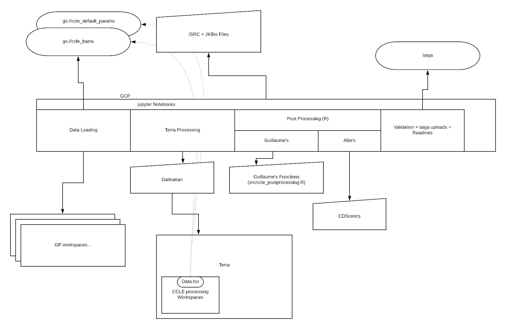
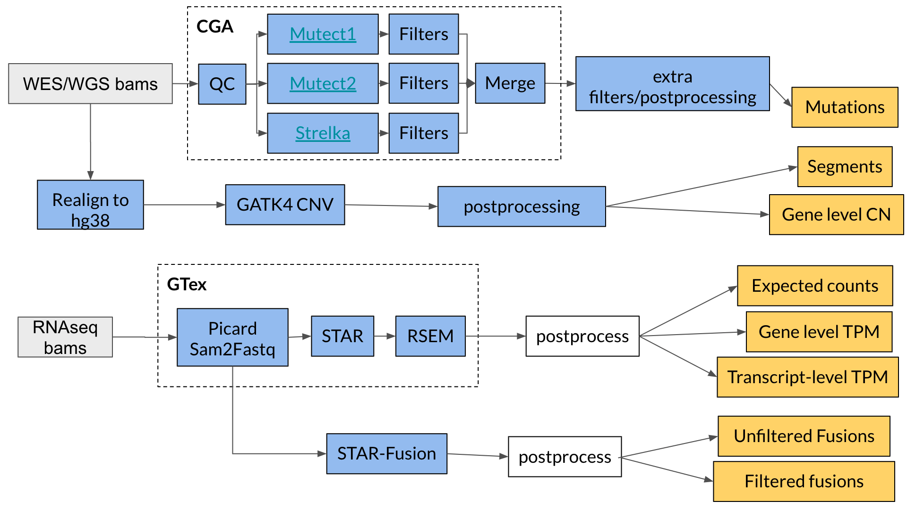

# depmap_omics

__have a look at [DepMap](https://www.depmap.org)__

What you need to process the Quarterly DepMap-Omics releases from Terra.

[Here](https://docs.google.com/presentation/d/1i0HI31dBejTYmzI9Cp6Ij7--t6eSR2r9vcC22TxSnNI/edit#slide=id.g525fd14bef_0_116) is a presentation of the pipeline.

## Table of Contents
- [Getting Started](#quickstart)
  - [Installation](#installation)
  - [For Internal Users](#internal-users)
  - [For External Users](#external-users)
- [Repository File Structure](#file-structure)
- [Running the Pipeline](#running-pipeline)
  - [Uploading and Preprocessing](#upload-preprocess)
  - [Running Terra Pipelines](#running-terra-pipelines)
  - [Downloading and Postprocessing](#downloading-postprocessing)
  - [QC, Groupding and Uploading](#qc-grouping-uploading)
- [Auxiliary Data for the Pipeline](#data)

## Getting Started 

If you are not familiar with these notions, we will first recommend you get more knowledge into each:

- [python](https://www.learnpython.org/)
- [R](https://www.codecademy.com/learn/learn-r)
- [jupyter](https://jupyter.org/index.html)
- [WDL](https://software.broadinstitute.org/wdl/documentation/)
- [gcp](https://cloud.google.com/sdk/docs/quickstart-macos)
- [docker](https://docs.docker.com/get-started/)
- [Terra](https://software.broadinstitute.org/firecloud/documentation/)
- [dalmatian](https://github.com/broadinstitute/dalmatian)
- [Terra and gcp](https://docs.google.com/document/d/1zTtaN-Px64f8JvgydZNdBbzBpFWyZzEpshSNxQh43Oc/edit#heading=h.dz5wh0l4bu9g)

### Installatiion 

`git clone http://github.com/BroadInstitute/depmap_omics.git && cd depmap_omics`

`pip install -e .`

### :warning: this repository needs other repos

Some important data and code from the [genepy Library](https://github.com/broadinstitute/genepy).

Use the instructions in the genepy page to install the package.

### :warning: you would need the following R python packages

1. You will need to install jupyter notetbooks and google cloud sdk
  - install [Google Cloud SDK](https://cloud.google.com/sdk/docs/downloads-interactive).
  - authenticate my SDK account by running `gcloud auth application-default login` in the terminal, and follow the instrucion to log in.

2. and GSVA for ssGSEA in R `R` run `R -e 'if(!requireNamespace("BiocManager", quietly = TRUE)){install.packages("BiocManager")};BiocManager::install(c("GSEABase", "erccdashboard", "GSVA", "DESeq2"));'`

3. For Python use the requirements.txt file `pip install -r requirements.txt` 

## For Internal Users 

> To learn about the tools we use in the pipeline, see [this section](#running-pipeline) for a detailed walkthrough

### Getting Terra Access

1. You will need to request access to the following terra workspaces:
  - [RNASeq](https://app.terra.bio/#workspaces/broad-firecloud-ccle/DepMap_hg38_RNAseq)
  - [WES](https://app.terra.bio/#workspaces/broad-firecloud-ccle/DepMap_WES_CN_hg38)
  - [WGS (including the mutation pipeline)](https://app.terra.bio/#workspaces/broad-firecloud-ccle/DepMap_WGS_CN)

The current owners of these workspaces should give you access.

2. For the mutation pipeline you will also need to request dbGaP access (required for TCGA workflows). *See CCLE/new hiree section on Asana for details*.
3. Acquire access to required billing projects (e.g. broad-firecloud-ccle). *See CCLE/new hiree section on Asana for details*.
4. Get access to the following Terra groups:
  - depmap_ccle_data
  - depmap-pipelines
  - ccle-pipeline
5. If you need to get access to the data delivered by Genomics Platform (GP) at the Broad, use the following links:
  - __WES__ [IBM](https://app.terra.bio/#workspaces/terra-broad-cancer-prod/Getz_IBM_CellLines_Exomes)
  - __WES__ [Broad](https://app.terra.bio/#workspaces/terra-broad-cancer-prod/CCLE_DepMap_WES)
  - __RNA__ [IBM](https://app.terra.bio/#workspaces/terra-broad-cancer-prod/Getz_IBM_CellLines_RNASeqData)
  - __RNA__ [Broad](https://app.terra.bio/#workspaces/terra-broad-cancer-prod/CCLE_DepMap_RNAseq)
  - __WGS__ [IBM](https://app.terra.bio/#workspaces/terra-broad-cancer-prod/Getz_IBM_CellLines_WGS)
  - __WGS__ [Broad](https://app.terra.bio/#workspaces/terra-broad-cancer-prod/DepMap_WGS)
6. Request access to the data bucket `gs://cclebams/`

### Additional python dependencies:
- [Taiga](https://cds.team/taiga) is a platform that allows the Cancer Data Science team to store and share data. In order to access and upload data, you will need to login to [taiga](https://cds.team/taiga) with your broad google account and [set up your token](https://github.com/broadinstitute/taigapy#prerequisites) for the python client.
- We are currently using a relational database, Gumbo, to track our cell lines' metadata and release status. In order to interact with Gumbo through python, follow the instruction and install the Gumbo client [here](https://github.com/broadinstitute/gumbo_client).

## For External Users 

> To learn about the tools we use in the pipeline, see [this section](#running-pipeline) for a detailed walkthrough

### Creating your Terra Workspaces:

1. You first need a [Terra](https://app.terra.bio/#) account with correct billing setup. See [here](https://support.terra.bio/hc/en-us/articles/360034677651-Account-setup-and-exploring-Terra) for a tutorial on getting started.
2. If you haven't already, create a workspace under the billing project of your choice. If you need to process both RNA and WGS data, we recommend creating one workspace for each. 
3. Import the WDL scripts by following the links to dockstore and clicking on *launch with terra* (note: you'll need both pipeline and aggregate for each data type):
    - __WGS__ [Pipeline](https://dockstore.org/workflows/github.com/broadinstitute/depmap_omics/WGS_pipeline)
    - __WGS__ [Aggregate](https://dockstore.org/workflows/github.com/broadinstitute/depmap_omics/WGS_aggregate)
    - __RNA__ [Pipeline](https://dockstore.org/workflows/github.com/broadinstitute/depmap_omics/RNA_pipeline)
    - __RNA__ [Aggregate](https://dockstore.org/workflows/github.com/broadinstitute/depmap_omics/RNA_aggregate)
4. DepMap's workspace configurations are saved after each data release under `data/`. We recommend using configurations from the latest quarter. For example, if the latest release is `21Q4`, you should be able to find the configurations in `data/21Q4/RNAconfig/all_configs.json` and `data/21Q4/RNAconfig/all_configs.json` for RNA and WGS, respectively.
5. Set up the right inputs and outpus for your workflows according to `inputs_[WORKFLOW_NAME].json` and `outputs_[WORKFLOW_NAME].json` files, which are under the same directory as `all_configs.json`.
6. Load your samples so that their bam and bam index google storage filepath get listed in the right data column to WGS_pipeline and RNA pipeline. 
7. Create a sample set with the set of samples you want to analyse. Make sure the name of this sample set on terra is the same as `SAMPLESETNAME` in `config_prod.py`.

Once this is done, you can launch your jupyter notebook server and run the `*_CCLE` jupyter notebooks corresponding to our RNA pipeline and WGS pipeline (older versions for WES (CN and mutations are available in a previous commit labelled 20Q4)).

Remark:
  1. you will need to use the `postProcesssing()` functions for post processing instead of the CCLE ones in the `dm_omics.py` module.
  2. you will need to change some of the variables in the `config_prod.py`.
  3. you won't be able to run the function conditional on the CCLE boolean. You can however reimplement them to create your own pipeline.

## Repository File Structure 

For our 2 computation pipelines for depmap omics:
- Expression and Fusion (RNA)
- Copy number and Mutations (WGS)

Each:
- can be run in a jupyter notebook file,
- gets data from Terra workspace's gcp buckets managed by Broad's Genomics Platform + DevOps (internal only), 
- updates the sample TSVs in the processing workspace on terra with paths to the files, 
- computes the results for each samples by running workflows, 
- downloads the results and postprocesses them with additional local functions,
- performs QC and uploads them to taiga (internal only).

__ccle_tasks/__ Contains a notebook for each of the different additional processing that the CCLE team has to perform as well as one-off tasks run by the omics team

__data/__ Contains important information used for processing, including terra workspace configurations from past quarters

__depmapomics/__ Contains the core python code used in the pipeline and called by the processing jupyter notebooks

__\*\_pipeline/__ Contains some of the pipeline's workflows' wdl files and script files used by these workflows 

__temp/__ Contains the temp file that can get removed after processing (should be empty)

__documentation/__ Contains some additional files and diagrams for documenting the pipelines

__tests/__ Contains automated pytest functions used internally for development

## Pipeline Walkthrough 

To run the CCLE pipeline we follow the installation process above and then boot up a GCP instance to run the notebooks from it.

You can find more documentation about the range of workspaces that have been created: [here](https://github.com/broadinstitute/ccle_processing/blob/master/documentation/firecloud_documentation.md)

We are using a set of key tools to process the sequencing output:
- __star__:
  - [https://www.ncbi.nlm.nih.gov/pubmed/23104886](https://www.ncbi.nlm.nih.gov/pubmed/23104886)
  - [https://github.com/alexdobin/STAR/blob/master/doc/STARmanual.pdf](https://github.com/alexdobin/STAR/blob/master/doc/STARmanual.pdf)
- __rsem__: 
  - [https://bmcbioinformatics.biomedcentral.com/articles/10.1186/1471-2105-12-323](https://bmcbioinformatics.biomedcentral.com/articles/10.1186/1471-2105-12-323)
- __star fusion__: 
  - [https://github.com/STAR-Fusion/STAR-Fusion/wiki](https://github.com/STAR-Fusion/STAR-Fusion/wiki)
  - [http://biorxiv.org/content/early/2017/03/24/120295](http://biorxiv.org/content/early/2017/03/24/120295)
- __mutect__: 
  - [https://software.broadinstitute.org/cancer/cga/mutect](https://software.broadinstitute.org/cancer/cga/mutect)
  - [https://youtu.be/rN-cLrb5aGs](https://youtu.be/rN-cLrb5aGs)
  - [https://www.nature.com/articles/nbt.2514](https://www.nature.com/articles/nbt.2514)
- __mutect2__:
  - [https://gatk.broadinstitute.org/hc/en-us/articles/360036490432-Mutect2](https://gatk.broadinstitute.org/hc/en-us/articles/360036490432-Mutect2)
- __gatk cnv__:
  - [https://software.broadinstitute.org/gatk/documentation/article?id=11682](https://software.broadinstitute.org/gatk/documentation/article?id=11682)
- __strelka__:
  - [https://www.nature.com/articles/s41592-018-0051-x](https://www.nature.com/articles/s41592-018-0051-x)
  - [https://github.com/Illumina/strelka](https://github.com/Illumina/strelka)
- __PureCN__:
  - [https://github.com/lima1/PureCN](https://github.com/lima1/PureCN)
- __MSIsensor2__:
  - [https://github.com/niu-lab/msisensor2](https://github.com/niu-lab/msisensor2)

The following flowchart provides another good overview of what the pipeline is doing.

_What is explained below comes from the notebook's documentations and might be better understood by reading them directly on the notebooks_

### 1. Uploading and Preprocessing (internal only) 

Currently, sequenced data for DepMap is generated by the Genomics Platform (GP) at the Broad who deposit them into several different Terra workspaces. Therefore, the first step of this pipeline is to look at these workspaces and

- identify new samples by looking at the bam files one by one and comparing them with bams we have onboarded
- remove duplicates and ones with broken file paths
- onboard new version of an old cell line's bam if we find any

**Remarks:**
- Although the loading function is for internal use only, external users should feel free to modify and use `createDatasetWithNewCellLines`, `GetNewCellLinesFromWorkspaces` or any other function in `loading.py` for their own needs when loading samples into Terra workspaces.

### 2. Running Terra Pipelines 

We are using Dalmatian to send requests to Terra, so before running this part, you need to make sure that your dalmatian `WorkspaceManager` object is initialized with the right workspace you created and that the functions take as input you workflow names. You also need to make sure that you created your sample set with all your samples and that you initialized the `sampleset` string in `config_prod.py` with its name.
You can then run the following two pipelines on your samples. The whole process may take 3-7 days.

#### Copy Numbers and Somatic Mutations

We are running the following workflows in this order to generate copy number and mutation datasets:

[WGS_pipeline](https://dockstore.org/workflows/github.com/broadinstitute/depmap_omics/WGS_pipeline:master?tab=info) imports and runs several sub-processes to generate copy number segments and mutation MAF data.

[WGS_aggregate](https://dockstore.org/workflows/github.com/broadinstitute/depmap_omics/WGS_aggregate:master?tab=info) aggregates CN segments and MAFs into their respective files.

The outputs to be downloaded will be saved under the sample set that you ran. The outputs we use for the release are:

*   combined_seg_file
*   filtered_CGA_MAF_aggregated
*   unfiltered_CGA_MAF_aggregated

* Note that additional files are used for QC

#### Expression and Fusion

We are generating both expression and fusion datasets with RNAseq data. Specifically, we use the [GTEx pipeline](https://github.com/broadinstitute/gtex-pipeline/blob/master/TOPMed_RNAseq_pipeline.md) to generate the expression dataset, and [STAR-Fusion](https://github.com/STAR-Fusion/STAR-Fusion/wiki) to generate gene fusion calls. This task also contains a flag that lets you specify if you want to delete the intermediates (fastqs) that can be large and might cost a lot to store. Run the following tasks on all samples that you need, in this order:

[RNA_pipeline](https://dockstore.org/workflows/github.com/broadinstitute/depmap_omics/RNA_pipeline:master?tab=info) imports and runs several sub-processes to generate RNA expression and fusion data matrices.

[RNA_aggregate](https://dockstore.org/workflows/github.com/broadinstitute/depmap_omics/RNA_aggregate:master?tab=info) aggregates expression and fusion data files into their respective aggregated file.

The outputs to be downloaded will be saved under the sample set that you ran. The outputs we use for the release are:

*   rsem_genes_expected_count
*   rsem_genes_tpm
*   rsem_transcripts_tpm
*   fusions_star

__Finally, we save the workflow configurations used in the pipeline runs__

**Remarks:**
- for the copy number pipeline we have parametrized both an XX version and an XY version, we recommend using the XY version as it covers the entire genome
- for the mutation pipeline we are working on Tumor-Normal pairs which explain some of the back and forth between the two workspace data table. (workflows works as well with or without matched normals.)
- for the expression pipeline, we have an additional set of workflows to call mutations from RNAseq, this might not be relevant to your need.

### 3. Downloading and Postprocessing (often called **on local** in the notebooks) 

This step will do a set of tasks:
- clean the workspaces by deleting large useless files, including unmapped bams.
- retrieve from the workspace interesting QC results.
- copy realigned bam files to our own data storage bucket.
- download the results.
- remove all duplicate samples from our downloaded file (keeping only the latest version of each sample).

_You would only be interested here at minima in the result downloading_
 
...and postprocessing tasks. The main postprocessing steps for each pipeline are as followed:

#### CN

`copynumbers.py` contains the main postprocessing function (`postProcess()` and their wrappers for internal use) responsible for postprocessing segments and creating gene-level CN files.

#### Mutation

`mutations.py` contains `postProcess()` (and its wrappers for internal use, including one for filtered and one for unfiltered mutation data), which is responsible for postprocessing aggregated MAF files and generating various types of mutation datasets.

#### RNA

`expressions.py` contains the main postprocessing function (`postProcess()` and their wrappers for internal use) responsible for postprocessing aggregated expression data from RSEM, which removes duplicates, renames genes, filters and log transforms entries, and generates protein-level expression data files.

##### Fusion

Functions responsible for postprocessing aggregated fusion data can be found in `fusions.py`. We want to apply filters to the fusion table to reduce the number of artifacts in the dataset. Specifically, we filter the following:

* Remove fusions involving mitochondrial chromosomes, or HLA genes, or immunoglobulin genes
* Remove red herring fusions (from STAR-Fusion annotations column)
* Remove recurrent in CCLE (>= 25 samples)
* Remove fusion with (SpliceType=" INCL_NON_REF_SPLICE" and LargeAnchorSupport="No" and FFPM < 0.1)
* Remove fusions with FFPM < 0.05 (STAR-Fusion suggests using 0.1, but looking at the translocation data, this looks like it might be too aggressive)

**Remarks:**
- in the RNAseq pipeline we have an additional sub-pipeline at the end of the notebook to process the fusion calls from starFusion
- to get the exact same results as in CCLE, be sure to run `genecn = genecn.apply(lambda x: np.log2(1+x))` to the genecn dataframe in the CNV pipeline (present at the end of the validation steps).
- we do not yet have integrated our germline calling in the mutation pipeline but you can still find the haplotypeCaller\|DeepVariant workflows and their parameters

### 4. QC, Grouping and Uploading to the Portal (internal use only) 

We then perform the following QC tasks for each dataset. These tasks should not be very interesting for external user as they revolve around manual checks of the data, comparison to previous releases, etc.

#### CN

Once the CN files are saved, we load them back in python and do some validations, in brief:

- mean, max, var...
- to previous version: same mean, max, var...
- checkAmountOfSegments: flag any samples with a very high number of segments
- checkGeneChangeAccrossAll: flag any genes which stay at a similar value across all samples

#### Mutation

__Compare to previous release (broad only)__

We compare the results to the previous releases MAF. Namely:

- Count the total number of mutations per cell line, split by type (SNP, INS, DEL)
- Count the total number of mutations observed by position (group by chromosome, start position, end position and count the number of mutations)
- Look at specific differences between the two MAFs (join on DepMap_ID, Chromosome, Start position, End position, Variant_Type). This is done for WES only

#### RNA

Once the expression files are saved, we do the following validations:
- mean, max, var...
- to previous version: same mean, max, var...
- we QC on the amount of genes with 0 counts for each samples

> After QC, we are also preparing the data to be released to different groups, removing the samples per access category: Blacklist\|Internal\|DepMapConsortium\|Public.

We are then uploading the data to a server called taiga where it will be used in the depmap portal

## Auxiliary Data for the Pipeline 

### PONS

for CN pons are made from a set of ~400 normals from the GTEx project as they were sequenced in the same fashion as CCLE samples with the same set of baits. you can see the ID of the samples in `data/samples_for_pons.csv`.
We have created pons for each bait set and using XY only.
We have used workflow from the pipeline:
`gatk/CNV_Somatic_Panel_Workflow`

### targets

The data we are presenting comes from different WES targets/baits/intervals.

We are currently using Illumina ICE intervals and Agilent intervals. you can find their related PON files and interval files as parameters in our workspace files in `data/xQx.json`

__additional auxilliary data is used and listed in some of our workflow, like the CGA pipeline. You will be able to find them by looking at the wdl scripts of each pipelines and looking into the data/xQx.json` files for workspace data files.__

@[jkobject](https://www.jkobject.com)
@gkugener
@gmiller
@5im1z
@__[BroadInsitute](https://www.broadinstitute.org)

If you have any feedback or run into any issues, feel free to post an issue on the github repo.
