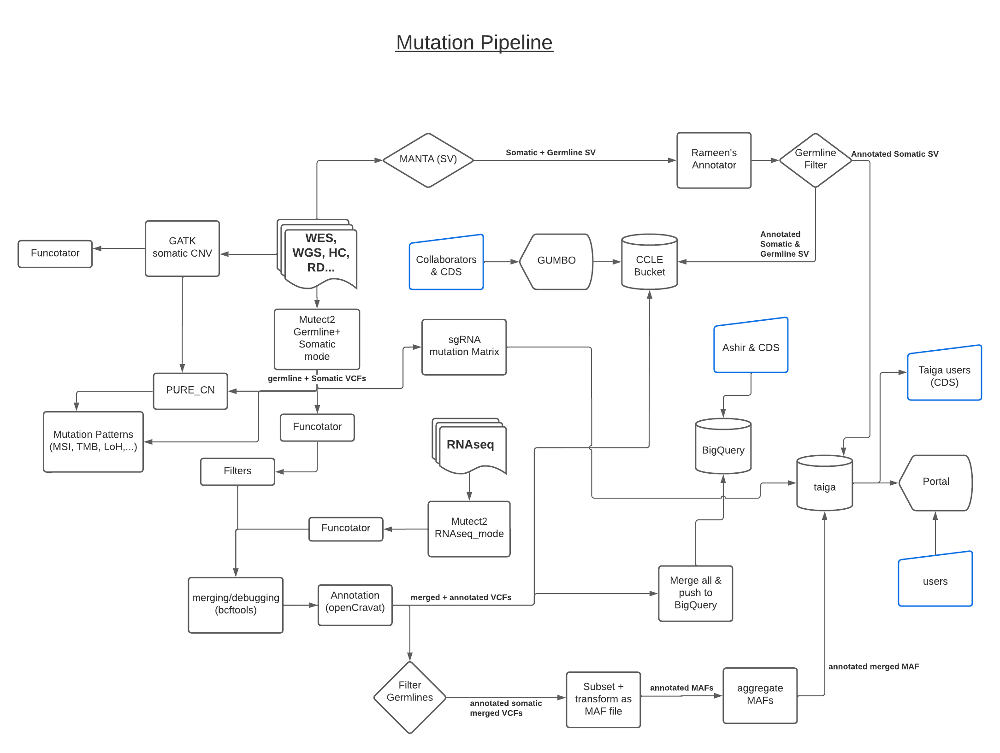

# mutation pipeline eplaination:

## comparison of mutect2 with the previous pipeline:

Here is a rough comparison of their output as a slide deck: 
[DepMap CGA Mutect2 Comparision](https://docs.google.com/presentation/d/1_dS3HBmq9XwdC7iRvhXV5lj6RAET57hainiEWweHaEQ/edit#slide=id.g11968108cb5_0_0)

## diagram of the pipeline

## comparison of the MAF output to the previous dataset's MAF (pre 22Q4)

1. dropped: "NCBI_Build": the same everywhere
2. dropped "End_Position", "Entrez_Gene_Id" (not useful)
3. dropped "Variant_Type" as it is not straight forward anymore an not given by annotators (harder to infer)
4. dropped "PASS"
5. dropped: "TCGAhsCnt", "isTCGAhotspot" (the same as the cosmic version and not available as default from most annotators)
6. dropped "Codon_Change", "cDNA_Change" as same as DNAchange
7. added many new columns: see [CCLE MAF colunms selection](https://docs.google.com/spreadsheets/d/1qP7-SWlUrSH85KWzK1aTRb_N6yvvE6yB6JfN-JUekt8/edit#gid=1503712741)
8. renamed columns: ‘dbSNP_RS’,‘dbSNP_Val_Status’,
9. not filtering likely immortalized mutations but annotating them: is_likely_immortalization
10. keeping more
11. solved bug removing key cancer mutations by adding better whitelisting based on oncoKB
    - mut is “driver” or #oncoKB
    - mut is “pathogenic” or # revel
    - mut is “likely_gof” or # oncoKB
    - mut is “clinically_significant” or # oncoKB | civic
    - mut is “lof” or # oncoKB
    - (
        - mut is “likely_lof” and # oncoKB | DANN
        - mut is in tumor_suppressor gene #oncoKB
    - ) or
    - (
        - mut is “likely_driver” and # oncoKB | cscape
        - mut is “hugo_symbol” is in oncogenic_list or tumor_suppressor_list #oncoKB
    - )
12. dropping any mutation with issues of mapping quality, slippage error, strand bias, part of clustered events (see 5.1), base quality,  as defined by GATK variant filter tool and default parameters. And any mutations with low depth (<3), low frequency (<0.15) or that is multiallelic.
    - clustered events are redefined over GATK filter’s definition by this [pipeline](https://github.com/broadinstitute/depmap_omics/blob/master/WGS_pipeline/correct_mutect2_clusteredevent.R) and as explained here: [Mutect2 clustered events correction #63](https://github.com/broadinstitute/depmap_omics/issues/63)
13. dropping any mutation that is non coding except if SPLICE_SITE event or whitelisted.
13. dropping any mutation that is germline according to mutect2's germline filtering model or in the PON or which population allele frequency from gnomad is more than 1 in 1000 except if whitelisted. (edited) 

correct_mutect2_clusteredevent.R
<https://github.com/broadinstitute/depmap_omics|broadinstitute/depmap_omics>broadinstitute/depmap_omics | Added by GitHub

#63 Mutect2 clustered events correction
<https://github.com/broadinstitute/depmap_omics|broadinstitute/depmap_omics>broadinstitute/depmap_omics | Apr 13th | Added by GitHub