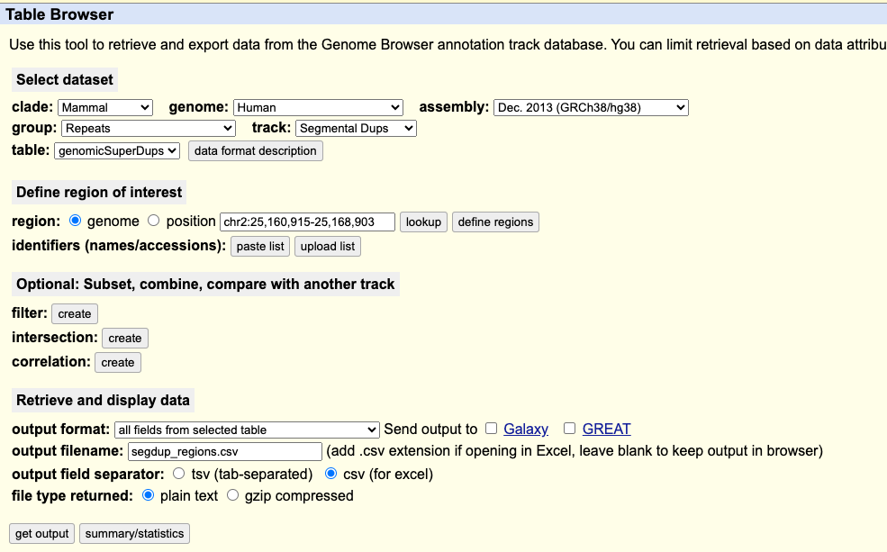
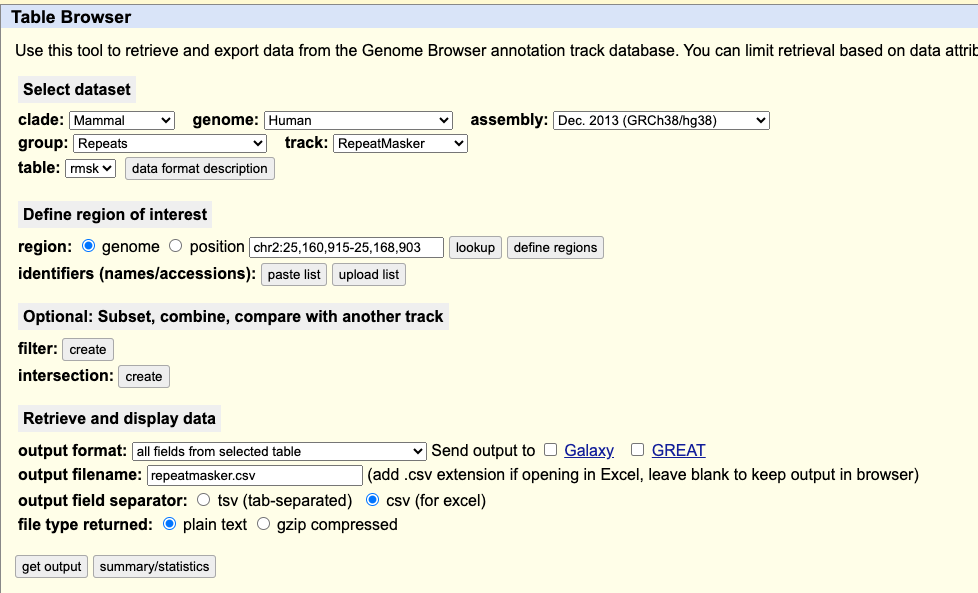

Whole genome sequencing pipeline for DepMap 
=============================================

Mutation calling pipeline
---------------------------

Mutation annotation and filtering pipeline
-------------------------------------------

CNV calling pipeline
---------------------------

Absolute CNV calling pipeline
-------------------------------

Structural variation calling pipeline
-----------------------------------------

Masking
--------------------------
Due to limitations of short read sequencing, confidence of copy number and mutation calls can be low in regions that are highly repeated or segmentally duplicated. As a result, we use RepeatMasker and Segmental Duplication downloaded from UCSC to mask potentially low quality calls that fall into these regions.

### Segmental Duplication:
The list of segmental duplication intervals is pulled from [UCSC's table browser](http://genome.ucsc.edu/cgi-bin/hgTables), inputs shown in screenshot below:

We then filtered this list by removing duplications where fracMatch < 0.98, as well as duplication pairs where neither segment is on a major contig. The bed file is then merged using `bedtools merge`. Processed bed file can be found at `data/segDup_majorAllele_withAltContigs_98pcFracMatch_merged.bed`.

For the gene-level copy number matrix, we calculated each gene's overlap with segmentally duplicated regions above and masked those where more than 50% of the gene body overlaps with segdup regions.

### Short repeat regions
The list of shorter repeated regions is puller from [UCSC's table browser](http://genome.ucsc.edu/cgi-bin/hgTables), inputs shown in screenshot below:

We then filtered this list by removing intervals where `max("milliDiv", "milliDel", "milliIns") > 10`. The bed file is then merged using `bedtools merge`. Processed bed file can be found at `data/repeatMasker_max10_noAlt_merged.bed`.

For each gene in the gene-level copy number matrix, we calculated its exons' overlap with repeatMasker regions above and masked those where more than 50% of the total exon length overlaps with repeatMasker regions.

### Rescuing

Starting in 24Q2, to avoid dropping cancer-relevant genes, we rescue all genes on [OncoKB’s oncogene list](https://www.oncokb.org/cancer-genes) even though they might fall into low-mapping quality regions. 

