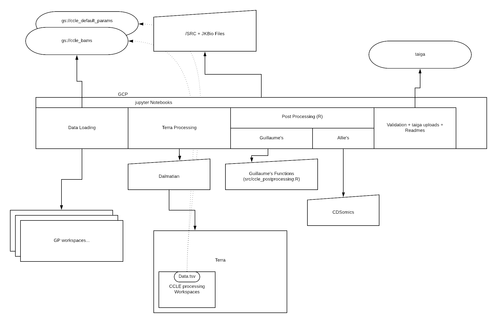
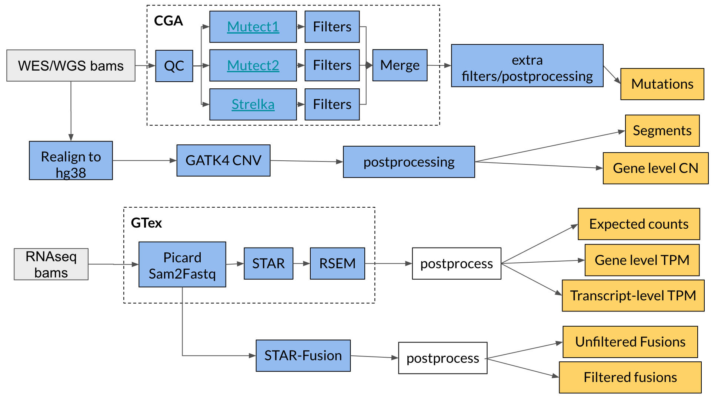

This document summarizes the key components in DepMap omics' processing pipeline.

 (outdated)

We are using a set of key tools to process the sequencing output:
- __star (from docker image `gcr.io/broad-cga-francois-gtex/gtex_rnaseq:V10`)__:
  - [https://www.ncbi.nlm.nih.gov/pubmed/23104886](https://www.ncbi.nlm.nih.gov/pubmed/23104886)
  - [https://github.com/alexdobin/STAR/blob/master/doc/STARmanual.pdf](https://github.com/alexdobin/STAR/blob/master/doc/STARmanual.pdf)
  - aligns RNAseq bam files for downstream processing
- __rsem (from docker image `gcr.io/broad-cga-francois-gtex/gtex_rnaseq:V10`)__: 
  - [https://bmcbioinformatics.biomedcentral.com/articles/10.1186/1471-2105-12-323](https://bmcbioinformatics.biomedcentral.com/articles/10.1186/1471-2105-12-323)
  - quantifes gene and isoform abundances from RNAseq data
- __star fusion (from docker image `trinityctat/starfusion:1.7.0`)__: 
  - [https://github.com/STAR-Fusion/STAR-Fusion/wiki](https://github.com/STAR-Fusion/STAR-Fusion/wiki)
  - [http://biorxiv.org/content/early/2017/03/24/120295](http://biorxiv.org/content/early/2017/03/24/120295)
  - outputs fusion predictions from RNAseq data
- __mutect__: (outdated?)
  - [https://software.broadinstitute.org/cancer/cga/mutect](https://software.broadinstitute.org/cancer/cga/mutect)
  - [https://youtu.be/rN-cLrb5aGs](https://youtu.be/rN-cLrb5aGs)
  - [https://www.nature.com/articles/nbt.2514](https://www.nature.com/articles/nbt.2514)

The following flowchart provides another good overview of what the pipeline is doing.

 (outdated)

Note that the WDL workflows (including their corresponding input references and parameters) for the following pipelines in any given quarter can be found in `data/*quarter*/`.

#### Copy Numbers and Somatic Mutations

We are running the following workflows to generate datasets from WGS data:

[WGS_pipeline](https://dockstore.org/workflows/github.com/broadinstitute/depmap_omics/WGS_pipeline:master?tab=info) runs several sub-processes to generate relative and absolute copy number segments, mutation MAF data, structural variant calls, and various genomic features including loss of heterozygosity (LOH), LOH fraction, ploidy estimate, Whole Genome Doubling (WGD), Chromasomal Instability (CIN), and MSI score. This workflow runs the following subtasks:
- __gatk cnv__:
  - outputs relative segment and copy number from WES/WGS data
  - [https://software.broadinstitute.org/gatk/documentation/article?id=11682](https://software.broadinstitute.org/gatk/documentation/article?id=11682)
- __strelka__: (outdated?)
  - [https://www.nature.com/articles/s41592-018-0051-x](https://www.nature.com/articles/s41592-018-0051-x)
  - [https://github.com/Illumina/strelka](https://github.com/Illumina/strelka)
- __mutect2 (from `broadinstitute/gatk:4.2.6.0`)__:
  - outputs mutation calls from RNAseq/WES/WGS data
  - [https://gatk.broadinstitute.org/hc/en-us/articles/360036490432-Mutect2](https://gatk.broadinstitute.org/hc/en-us/articles/360036490432-Mutect2)
- __PureCN__:
  - computes absolute copy number, as well as features including loss of heterozygosity (LOH), LOH fraction, ploidy estimate, Whole Genome Doubling (WGD), Chromasomal Instability (CIN) from WES/WGS data
  - For some samples, PureCN requires manual curation to determine the most plausible solution. Details about this can be found in the `WGS_CCLE.ipynb` notebook
  - [Details on how PureCN is run for DepMap data](../WGS_pipeline/PureCN_pipeline/README.md)
  - [https://github.com/lima1/PureCN](https://github.com/lima1/PureCN)
- __MSIsensor2__:
  - computes Microsatellite Instability (MSI) score from WES/WGS data
  - [https://github.com/niu-lab/msisensor2](https://github.com/niu-lab/msisensor2)
- __Manta__:
  - calls structural variants from WES/WGS data
  - [https://github.com/Illumina/manta](https://github.com/Illumina/manta)

[WGS_aggregate](https://dockstore.org/workflows/github.com/broadinstitute/depmap_omics/WGS_aggregate:master?tab=info) aggregates outputs from the previous workflow (CN segments and MAFs) into their respective files.

The outputs to be downloaded will be saved under the sample set that you ran. The outputs we use for the release are:

*   combined_seg_file
*   filtered_CGA_MAF_aggregated
*   unfiltered_CGA_MAF_aggregated

* Note that additional files are used for QC

#### Expression and Fusion

We are generating both expression and fusion datasets with RNAseq data. Specifically, we use the [GTEx pipeline](https://github.com/broadinstitute/gtex-pipeline/blob/master/TOPMed_RNAseq_pipeline.md) to generate the expression dataset, and [STAR-Fusion](https://github.com/STAR-Fusion/STAR-Fusion/wiki) to generate gene fusion calls. This task also contains a flag that lets you specify if you want to delete the intermediates (fastqs) that can be large and might cost a lot to store. The following two workflows are run in this order:

[RNA_pipeline](https://dockstore.org/workflows/github.com/broadinstitute/depmap_omics/RNA_pipeline:master?tab=info) imports and runs several sub-processes to generate RNA expression and fusion data matrices.

[RNA_aggregate](https://dockstore.org/workflows/github.com/broadinstitute/depmap_omics/RNA_aggregate:master?tab=info) aggregates expression and fusion data files into their respective aggregated file.

The outputs to be downloaded will be saved under the sample set that you ran. The outputs we use for the release are:

*   rsem_genes_expected_count
*   rsem_genes_tpm
*   rsem_transcripts_tpm
*   fusions_star

__Finally, we save the workflow configurations used in the pipeline runs__

**Remarks:**
- for the copy number pipeline we have parametrized both an XX version and an XY version, we recommend using the XY version as it covers the entire genome
- for the mutation pipeline we are working on Tumor-Normal pairs which explain some of the back and forth between the two workspace data table. (workflows works as well with or without matched normals.)
